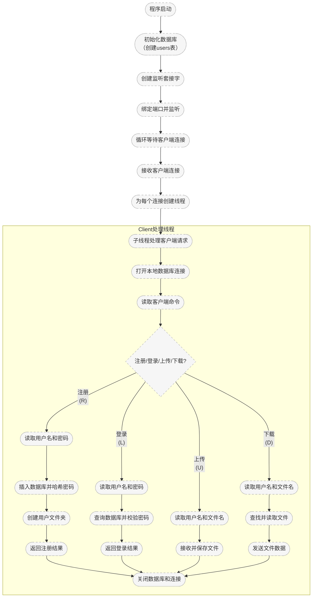

# Linux网盘项目
## 第一阶段
第一阶段的工程目录：
```c
/c-netdisk
├── server/
│   ├── main.c         // 启动服务、监听端口、分发请求
├── client/
│   ├── main.c         // 命令行操作、菜单交互
├── Makefile
├── README.md
```
`server/main.c`内容：
```c
#include <stdio.h>
#include <stdlib.h>
#include <string.h>
#include <unistd.h>
#include <arpa/inet.h>// For inet_ntoa
#include <sys/socket.h>
#include <netinet/in.h>

#define PORT 9000

int main(){
    int listen_fd, conn_fd;
    struct sockaddr_in server_addr, cli_addr;// Server and client address structures

    socklen_t cli_len = sizeof(cli_addr);// Length of client address structure

    char buffer[1024];
    ssize_t n;

    // Create a socket
    listen_fd=socket(AF_INET, SOCK_STREAM, 0);
    if(listen_fd < 0) {
        perror("socket creation error❌");
        exit(EXIT_FAILURE);
    }
    //Bind port and address
    server_addr.sin_family = AF_INET;
    server_addr.sin_addr.s_addr = INADDR_ANY; // Bind to any address
    server_addr.sin_port = htons(PORT); // Set port number
    if(bind(listen_fd,(struct sockaddr *)&server_addr, sizeof(server_addr))<0){
        perror("bind error❌");
        exit(EXIT_FAILURE);
    }

    // Listen for incoming connections
    if(listen(listen_fd, 5) < 0) {
        perror("listen error❌");
        exit(EXIT_FAILURE);
    }
    printf("✅Server is listening on port %d\n", PORT);
    while(1){
        conn_fd = accept(listen_fd,(struct sockaddr *)&cli_addr, &cli_len);
        if(conn_fd<0){
            perror("accept error❌");
            continue; // Continue to accept next connection
        }

        //简单菜单：先收指令
        char cmd;
        read(conn_fd,&cmd, sizeof(cmd));
        if(cmd=='U'){// 上传文件
            FILE *fp=fopen("server_recv.txt", "wb");// Open file for writing
            if(fp == NULL) {
                perror("File open error❌");
                close(conn_fd);
                continue; // Continue to accept next connection
            }
            while( (n=read(conn_fd,buffer,sizeof(buffer))) >0){
                fwrite(buffer, sizeof(char), n, fp); // Write data to file
            }
            printf("File uploaded successfully as server_recv.txt! ✅\n");
            fclose(fp); // Close the file
        }
        else if(cmd=='D'){// 下载文件
            FILE *fp=fopen("server_recv.txt", "rb");// Open file for reading
            if(fp == NULL) {
                perror("File open error❌");
                close(conn_fd);
                continue; // Continue to accept next connection
            }
            while((n=fread(buffer,1, sizeof(buffer), fp))>0){// Read data from file
                write(conn_fd, buffer, n); // Send data to client
            } 
            printf("File server_recv.txt send to client successfully! ✅\n");
            fclose(fp); // Close the file
        }
        close(conn_fd); // Close the connection
    }
    close(listen_fd); // Close the listening socket
    return 0;
}
```
分段解读：
```c
#include <stdio.h>
#include <stdlib.h>
#include <string.h>
#include <unistd.h>
#include <arpa/inet.h>// For inet_ntoa
#include <sys/socket.h>
#include <netinet/in.h>

#define PORT 9000

```
加入头文件，宏定义端口号

`main`函数内容
```c
int listen_fd, conn_fd;
struct sockaddr_in server_addr, cli_addr;// Server and client address structures

socklen_t cli_len = sizeof(cli_addr);// Length of client address structure

char buffer[1024];
ssize_t n;
```
定义监听描述符`listen_fd`和连接描述符`conn_fd`。

定义`sockaddr_in`的结构体变量`server_addr`,`cli_addr`分别用于存储服务器和客户端的 IPv4 地址信息。

socket三板斧：创建->绑定->监听：
```c
// Create a socket
listen_fd=socket(AF_INET, SOCK_STREAM, 0);
if(listen_fd < 0) {
    perror("socket creation error❌");
    exit(EXIT_FAILURE);
}
```
`listen_fd=socket(AF_INET, SOCK_STREAM, 0);`创建一个监听的套接字文件描述符，指定地址族为IPv4，`SOCK_STREAM`：指定套接字类型为流式套接字（TCP）,`0`：指定协议，通常为 0，表示使用默认协议（TCP 对应 IPPROTO_TCP）

```c
//Bind port and address
server_addr.sin_family = AF_INET;
server_addr.sin_addr.s_addr = INADDR_ANY; // Bind to any address
server_addr.sin_port = htons(PORT); // Set port number
```
设置了服务器地址结构体 `server_addr` 的字段
```c
if(bind(listen_fd,(struct sockaddr *)&server_addr, sizeof(server_addr))<0){
    perror("bind error❌");
    exit(EXIT_FAILURE);
}
```
`bind`函数绑定监听文件描述符`listen_fd`和服务器地址`server_addr`

接下来时简单的监听过程的实现：只支持上传和下载对应文件

`server/main.c`:



